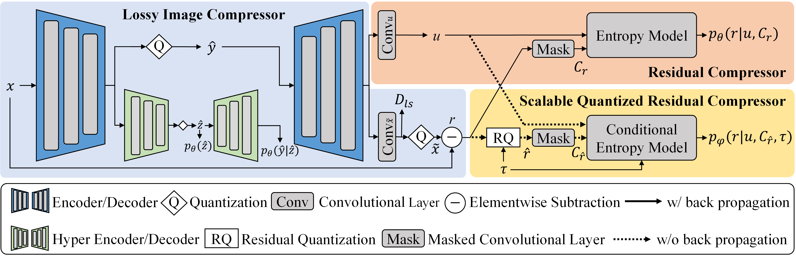

# Deep-Lossy-Plus-Residual-Coding
Deep Lossy Plus Residual (DLPR) coding is the state-of-the-art learning-based lossless and near-lossless image compression method with fast running speed (TPAMI'24).


## Usage
The code is run with `Python 3.9`, `Pytorch 1.11.0`, `Timm 0.5.4`, `Torchac 0.9.3` and `Compressai 1.2.0`.

### Data preparation
Download and extract `DIV2K_train_HR` and `DIV2K_valid_HR` high-resolution images from https://data.vision.ee.ethz.ch/cvl/DIV2K/ to `./Datasets`. 
```
./Datasets/
  DIV2K_train_HR/
      img1.png
      img2.png
  DIV2K_valid_HR/
      img3.png
      img4.png
  extract_patches_train.py
  extract_patches_valid.py
```
Run `extract_patches_train.py` and `extract_patches_valid.py` to crop 2K images into $128\times 128$ patches for network training.

### DLPR coding for lossless compression
Upating

### DLPR coding for near-lossless compression
Updating

## Citation

```
@ARTICLE{DLPR,
  author={Bai, Yuanchao and Liu, Xianming and Wang, Kai and Ji, Xiangyang and Wu, Xiaolin and Gao, Wen},
  journal={IEEE Transactions on Pattern Analysis and Machine Intelligence}, 
  title={Deep Lossy Plus Residual Coding for Lossless and Near-lossless Image Compression}, 
  year={2024},
  pages={1-18},
  doi={10.1109/TPAMI.2023.3348486}
}
```
